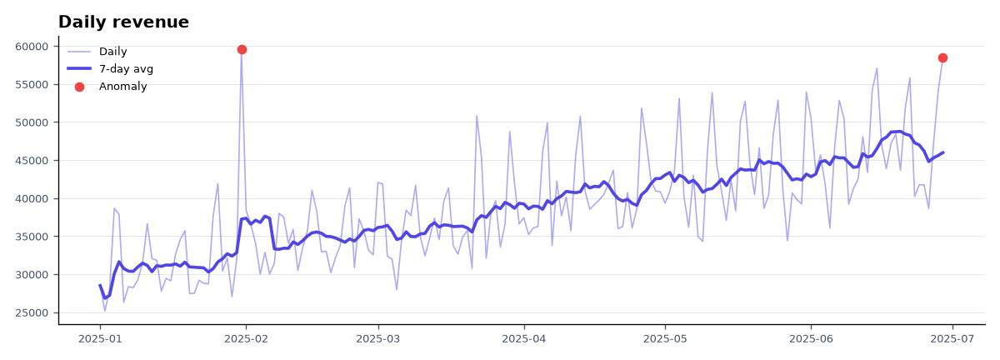
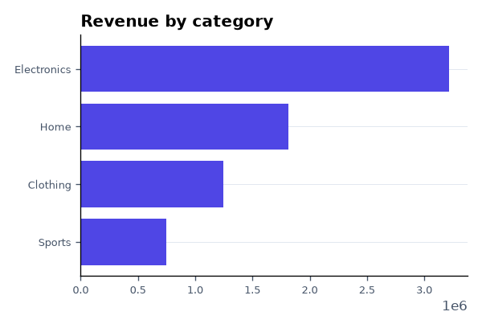
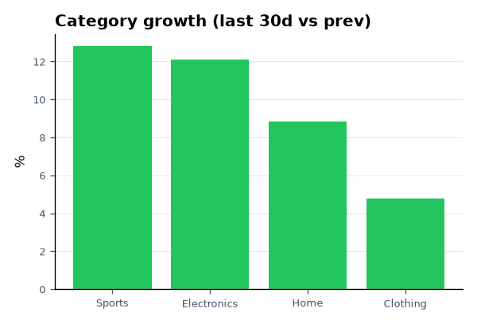
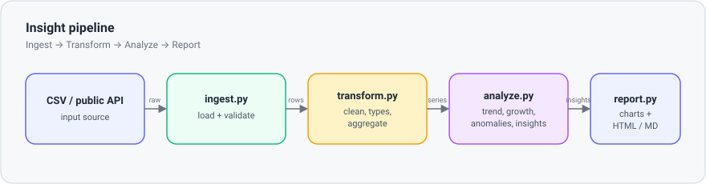

<!-- ══════════════════════════ TITLE ══════════════════════════ -->
<div align="center">
  
</div>

<br/>

<!-- ══════════════════════ IDIOMAS / LANGUAGES ══════════════════════ -->
<div align="center">
<a href="README.md"></a>
<a href="README.en.md"></a>
<a href="README.es.md"></a>
</div>

<br/>

<div align="center">

<br/>


</div>

<div align="center">
<a href="#about"></a>
<a href="#what-it-does"></a>
<a href="#architecture"></a>
<a href="#usage"></a>
<a href="#automation"></a>
</div>

<br/>

> 💡 **One command, CSV to report.** `python -m insight run` generates the HTML dashboard using the bundled sample dataset.

<div align="center">
  
</div>

## About

**Insight** is a small but complete data pipeline: it ingests a CSV (or fetches a live public API), cleans and aggregates the data, detects trends and anomalies, and renders an HTML/Markdown report with charts — all from one command.

## What it does

- **Ingest** — load a CSV (validated schema) or fetch live FX rates from a free public API (no key).
- **Transform** — coerce types, drop bad rows, fill date gaps, aggregate to a daily series and per-category totals (pandas).
- **Analyze** — 7-day moving average trend, period-over-period growth, z-score anomaly detection, per-category growth ranking, best/worst day, and plain-English insights generated from the numbers.
- **Report** — matplotlib charts + a self-contained HTML dashboard + a Markdown report.

**Example output:**
```
• Total revenue of $7,027,351 across 180 days (2025-01-01 → 2025-06-29).
• Revenue is up 10.0% over the last 30 days vs the previous 30.
• Top category is Electronics ($3,217,331, 46% of revenue).
• Fastest-growing category: Sports (+12.8%).
• Detected 2 anomalous day(s); biggest is a spike on 2025-01-31 (z=+2.8).
```

| Revenue by category | Category growth |
|:---:|:---:|
|  |  |

## Architecture

<div align="center">
  
</div>

| Module | Responsibility |
|---|---|
| `insight/ingest.py` | Load + validate the input CSV |
| `insight/transform.py` | Clean, type-coerce, aggregate (daily series, by category) |
| `insight/analyze.py` | Moving average, growth, z-score anomalies, category movers, insights |
| `insight/report.py` | Render charts and the HTML/Markdown report |
| `insight/sources.py` | Optional live source (Frankfurter FX API) |
| `insight/cli.py` | `python -m insight run` command-line interface |

## Usage

```bash
python -m venv .venv && source .venv/bin/activate   # Windows: .venv\Scripts\activate
pip install -r requirements.txt

python -m insight run
python -m insight run --input data/sample_sales.csv --out report --window 30 --z 2.5
python -m insight run --source frankfurter   # live public dataset
```

Open `report/index.html` to view the dashboard.

**Tests:**
```bash
pytest -q
```

## Automation

`.github/workflows/report.yml` regenerates the report **every Monday** (and on demand), uploading it as a downloadable artifact — scheduled analytics with no infrastructure. `ci.yml` runs the test suite on every push.

## License

[MIT](LICENSE).

<div align="center">
  
</div>

<p align="center"><sub>Built by <strong><a href="https://github.com/geoggrigori">Grigori</a></strong> · 2026</sub></p>
