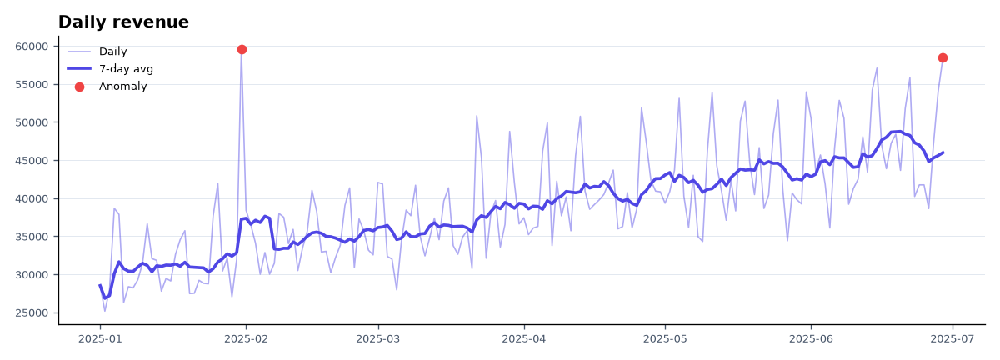
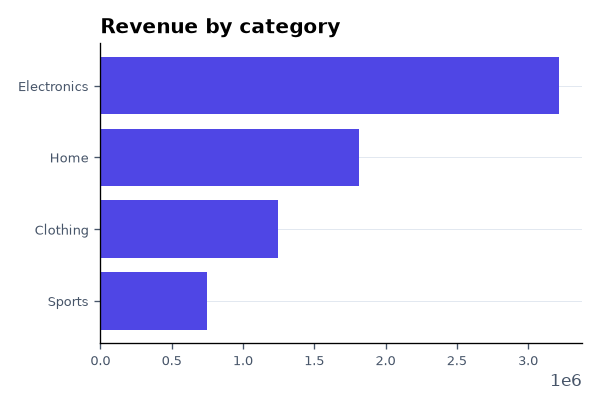
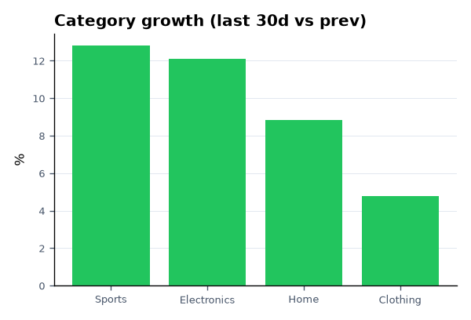

# Insight 📊 — Data Pipeline & Automated Reporting

A small but complete **data pipeline** that turns raw records into an **automated insights report**: it ingests a CSV (or a live public API), cleans and aggregates the data, detects trends and anomalies, and renders an HTML/Markdown report with charts — all from one command.

> Ingest → Transform → Analyze → Report, as clean, tested Python.


---

## ✨ What it does

- **Ingest** — load a CSV (validated schema) or fetch live FX rates from a free public API (no key).
- **Transform** — coerce types, drop bad rows, fill date gaps, aggregate to a daily series and per-category totals (pandas).
- **Analyze** —
  - 7-day **moving average** trend
  - **period-over-period growth** (last *N* days vs the previous *N*)
  - **anomaly detection** via z-scores (flags unusual spikes/dips)
  - **per-category growth** ranking (top movers)
  - best/worst day, category mix
  - a set of **plain-English insights** generated from the numbers
- **Report** — matplotlib charts + a self-contained **HTML** dashboard and a **Markdown** report.

## 🚀 Usage

```bash
python -m venv .venv && source .venv/bin/activate   # Windows: .venv\Scripts\activate
pip install -r requirements.txt

# Run on the bundled sample dataset
python -m insight run

# Options
python -m insight run --input data/sample_sales.csv --out report --window 30 --z 2.5

# Or pull a live public dataset (FX rates, no API key)
python -m insight run --source frankfurter
```

Open `report/index.html` to view the dashboard.

### Example output

```
• Total revenue of $7,027,351 across 180 days (2025-01-01 → 2025-06-29).
• Revenue is up 10.0% over the last 30 days vs the previous 30.
• Top category is Electronics ($3,217,331, 46% of revenue).
• Fastest-growing category: Sports (+12.8%).
• Best day: 2025-01-31 ($59,594); slowest day: 2025-01-02 ($25,158).
• Detected 2 anomalous day(s); biggest is a spike on 2025-01-31 (z=+2.8).
```

### Generated charts

The pipeline renders these automatically (real output from the bundled dataset):

| Daily revenue & 7-day trend (anomalies in red) |
|:----------------------------------------------:|
|  |

| Revenue by category | Category growth |
|:-------------------:|:---------------:|
|  |  |

## 🏗️ Architecture

```
  CSV / public API
        │
        ▼
  ingest.py  ──▶  transform.py  ──▶  analyze.py  ──▶  report.py
  (load +         (clean, types,     (trend, growth,   (matplotlib
   validate)       aggregate)         anomalies,        charts +
                                      insights)         HTML/MD)
```

| Module | Responsibility |
|--------|----------------|
| `insight/ingest.py`    | Load + validate the input CSV |
| `insight/transform.py` | Clean, type-coerce, aggregate (daily series, by category) |
| `insight/analyze.py`   | Moving average, growth, z-score anomalies, category movers, insights |
| `insight/report.py`    | Render charts and the HTML/Markdown report |
| `insight/sources.py`   | Optional live source (Frankfurter FX API) |
| `insight/cli.py`       | `python -m insight run` command-line interface |
| `scripts/make_sample.py` | Regenerate the deterministic sample dataset |

## 🧪 Tests

```bash
pytest -q
```

The analysis core is covered by deterministic unit tests — moving average, growth math, anomaly detection, and category ranking on known inputs, plus an end-to-end `analyze()` check.

## ⏱️ Automation

`.github/workflows/report.yml` regenerates the report **every Monday** (and on demand) and uploads it as a downloadable artifact — a simple "scheduled analytics" setup with no infrastructure. `ci.yml` runs the test suite on every push.

## 🛠️ Tech stack

- **Python** (3.13+), **pandas**, **matplotlib**
- **Testing:** pytest
- **Automation:** GitHub Actions (CI + scheduled report)

## 📝 Notes

- The bundled dataset is **synthetic but realistic** (trend + weekly seasonality + injected anomalies), generated deterministically by `scripts/make_sample.py`.
- The pipeline is **metric-agnostic**: point it at any `date, category, units, revenue` CSV, or adapt `sources.py` to another feed.

---

Built as a portfolio project to demonstrate an end-to-end data workflow: ingestion, cleaning, analysis, visualization, and automation.
