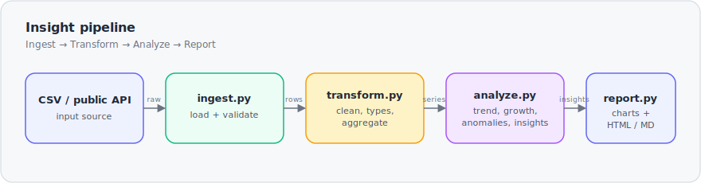

# Insight 📊 — Pipeline de Dados & Relatórios Automatizados

[English](README.md) · **Português** · [Español](README.es.md)

Um **pipeline de dados** pequeno, mas completo, que transforma registros brutos em um **relatório de insights automatizado**: ele ingere um CSV (ou uma API pública ao vivo), limpa e agrega os dados, detecta tendências e anomalias e gera um relatório em HTML/Markdown com gráficos — tudo a partir de um único comando.

> Ingestão → Transformação → Análise → Relatório, em Python limpo e testado.


---

## ✨ O que ele faz

- **Ingestão** — carrega um CSV (com esquema validado) ou busca cotações de câmbio ao vivo em uma API pública gratuita (sem chave).
- **Transformação** — converte tipos, descarta linhas inválidas, preenche lacunas de datas, agrega em uma série diária e em totais por categoria (pandas).
- **Análise** —
  - tendência por **média móvel** de 7 dias
  - **crescimento período a período** (últimos *N* dias vs. os *N* anteriores)
  - **detecção de anomalias** por z-score (sinaliza picos/quedas atípicos)
  - ranking de **crescimento por categoria** (maiores variações)
  - melhor/pior dia, composição por categoria
  - um conjunto de **insights em linguagem natural** gerados a partir dos números
- **Relatório** — gráficos em matplotlib e um **dashboard HTML** autocontido, além de um relatório em **Markdown**.

## 🚀 Uso

```bash
python -m venv .venv && source .venv/bin/activate   # Windows: .venv\Scripts\activate
pip install -r requirements.txt

# Run on the bundled sample dataset
python -m insight run

# Options
python -m insight run --input data/sample_sales.csv --out report --window 30 --z 2.5

# Or pull a live public dataset (FX rates, no API key)
python -m insight run --source frankfurter
```

Abra `report/index.html` para ver o dashboard.

### Exemplo de saída

```
• Total revenue of $7,027,351 across 180 days (2025-01-01 → 2025-06-29).
• Revenue is up 10.0% over the last 30 days vs the previous 30.
• Top category is Electronics ($3,217,331, 46% of revenue).
• Fastest-growing category: Sports (+12.8%).
• Best day: 2025-01-31 ($59,594); slowest day: 2025-01-02 ($25,158).
• Detected 2 anomalous day(s); biggest is a spike on 2025-01-31 (z=+2.8).
```

### Gráficos gerados

O pipeline gera estes gráficos automaticamente (saída real do conjunto de dados incluído):

| Receita diária & tendência de 7 dias (anomalias em vermelho) |
|:----------------------------------------------:|
|  |

| Receita por categoria | Crescimento por categoria |
|:-------------------:|:---------------:|
|  |  |

## 🏗️ Arquitetura



| Módulo | Responsabilidade |
|--------|----------------|
| `insight/ingest.py`    | Carrega + valida o CSV de entrada |
| `insight/transform.py` | Limpa, converte tipos, agrega (série diária, por categoria) |
| `insight/analyze.py`   | Média móvel, crescimento, anomalias por z-score, variações por categoria, insights |
| `insight/report.py`    | Gera os gráficos e o relatório em HTML/Markdown |
| `insight/sources.py`   | Fonte ao vivo opcional (API de câmbio Frankfurter) |
| `insight/cli.py`       | Interface de linha de comando `python -m insight run` |
| `scripts/make_sample.py` | Regera o conjunto de dados de exemplo determinístico |

## 🧪 Testes

```bash
pytest -q
```

O núcleo de análise é coberto por testes unitários determinísticos — média móvel, cálculo de crescimento, detecção de anomalias e ranking por categoria sobre entradas conhecidas, além de uma verificação ponta a ponta de `analyze()`.

## ⏱️ Automação

`.github/workflows/report.yml` regera o relatório **toda segunda-feira** (e sob demanda) e o publica como um artefato disponível para download — uma configuração simples de "analytics agendado", sem infraestrutura. `ci.yml` executa a suíte de testes a cada push.

## 🛠️ Stack tecnológica

- **Python** (3.13+), **pandas**, **matplotlib**
- **Testes:** pytest
- **Automação:** GitHub Actions (CI + relatório agendado)

## 📝 Notas

- O conjunto de dados incluído é **sintético, mas realista** (tendência + sazonalidade semanal + anomalias injetadas), gerado de forma determinística por `scripts/make_sample.py`.
- O pipeline é **agnóstico em relação à métrica**: aponte-o para qualquer CSV no formato `date, category, units, revenue`, ou adapte `sources.py` para outra fonte.

---

Construído como projeto de portfólio para demonstrar um fluxo de dados ponta a ponta: ingestão, limpeza, análise, visualização e automação.
